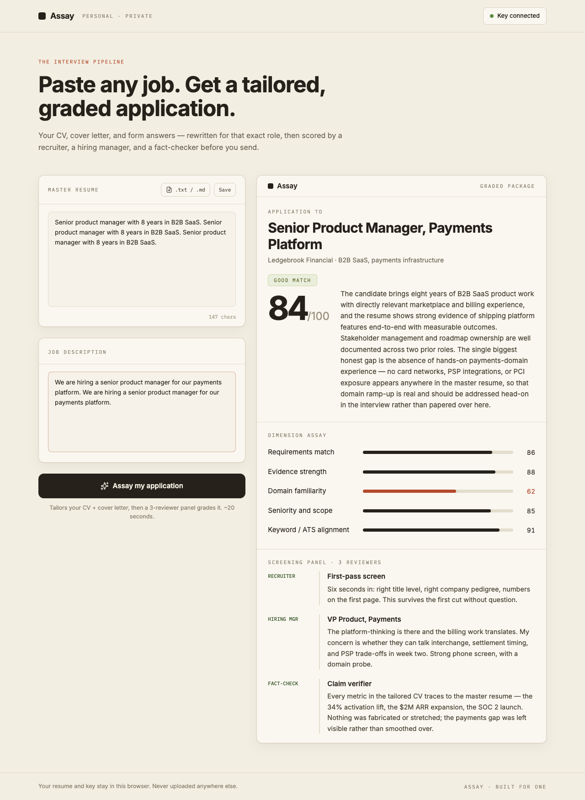
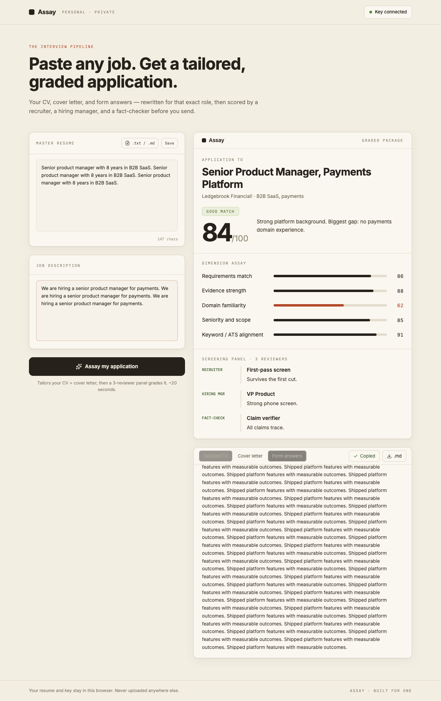
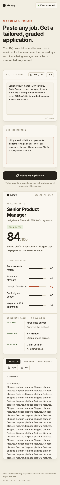

# Argus

*A personal career toolkit, built for one. First module: **Assay**.*

## Assay — paste any job, get a tailored, graded application

Assay takes any job description and your one master resume, and produces a complete application package: a tailored CV, a cover letter, and answers to the screening questions you're most likely to face. Before you send anything, a simulated three-person panel — a recruiter, a hiring manager, and a fact-checker — grades the package honestly.







## How it works

- Save your master resume once — paste it or upload a PDF/DOCX, with text extracted entirely in your browser.
- Paste any job description.
- One structured call to Gemini builds the full package — CV, cover letter, and form answers — and you can export the tailored CV or cover letter as a clean PDF via your browser's print dialog.
- The package is scored 0–100 across five dimensions and reviewed by the three-person panel, then auto-saved — each saved assay becomes a tracked application on the **Pipeline** page: set its status (Saved → Applied → Interview → Offer / Rejected), keep private notes on it, and watch your pipeline stats at a glance.
- Across all saved assays, an Insights panel shows what the market keeps demanding and where your evidence is repeatedly weak — and after you improve your resume, one click re-runs any old JD to prove the score moved.
- For any saved assay, generate an interview prep pack: the questions this exact JD makes likely — including probes at your weak spots — with honest STAR answers drawn only from your real resume, plus a flashcard practice mode.
- The Pipeline's follow-up radar flags applications gone silent (7 days after applying, 5 after an interview), drafts the polite nudge with your own AI key, and drops a reminder into your calendar as an .ics file.

## Privacy

There is no backend. Your resume, API keys, and assay history live only in your browser's localStorage. Nothing is uploaded anywhere except the single prompt sent directly to the provider's API with your own key. The Settings page can export or restore a full backup of everything — history, notes, prep, keys, resume — as one JSON file.

## Anti-fabrication

The system prompt forbids inventing experience, metrics, employers, or skills — content may only be reframed, reordered, and emphasized from what actually exists in your real resume. A dedicated fact-check reviewer names anything that was softened, stretched, or is unsupported, and confirms what traces to real evidence.

## Run locally

```sh
cd assay
npm install
npm run dev
```

Then add an API key from any of Gemini, Groq, OpenAI, or Claude via the key button in the app header — Gemini and Groq have free tiers; OpenAI and Claude are paid per use. Add one or more keys — with multiple keys saved, Assay fails over automatically when one provider is rate-limited.

## Roadmap

- [x] Application tracker (statuses, notes, stats)
- [x] Gap intelligence across saved assays
- [x] Resume version diffing
- [x] Interview prep from any saved assay
- [ ] Test suite + CI
